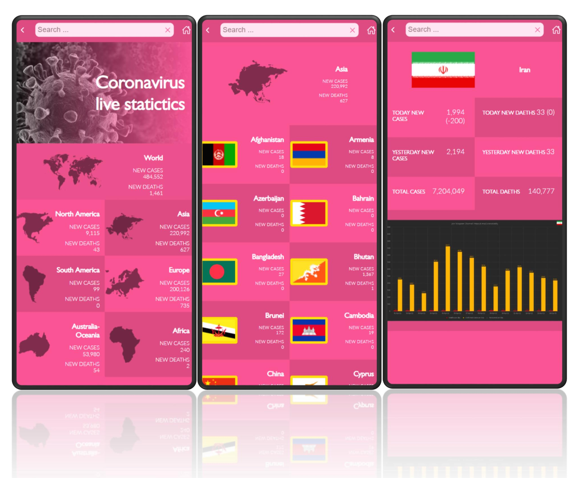

# Covid-19 Live Statistics
React & Redux capstone project. This project is done on module 3, week 5 of the Microverse full-stack development program.

# Requirements for this project

Please find the requirements for this project [here](https://github.com/microverseinc/curriculum-react-redux/blob/main/capstone/react_capstone.md).

# screenshot 

## Technologies

- HTML
- CSS & SASS
- JS (ES6)
- React
- Redux
- JEST & React testing library

## Live Demo
You can find the live demo on [Netlify](https://effortless-travesseiro-5acbee.netlify.app/). 

## Getting Started

To get a local copy follow these simple example steps.  

1. Open the terminal window and clone the repository using this command:  
`git clone https://github.com/Behnam1369/COVID19.git` 
2. Change the directory to the react-bookstore directory:  
`cd COVID19`  
3. Install the project's dependencies by running this command:   
`npm install`   
4. Run the application using:
`npm start`  
5. For runnig the application tests excute below command: 
`npm run test` 

## Authors

👤 **Behnam Aghaali**

- GitHub: [https://github.com/Behnam1369](https://github.com/Behnam1369)
- LinkedIn: [https://www.linkedin.com/in/behnam-aghaali](https://www.linkedin.com/in/behnam-aghaali)
- Twitter: [https://twitter.com/behnamagh1369](https://twitter.com/behnamagh1369)
- Email: [behnam.aghaali@yahoo.com](mailto:behnam.aghaali@yahoo.com)

## 🤝 Contributing

Contributions, issues, and feature requests are welcome!

Feel free to check the [issues page](../../issues/).

## Show your support

Give a ⭐️ if you like this project!

## Acknowledgments

Original design idea by [Nelson Sakwa on Behance](https://www.behance.net/sakwadesignstudio).

## 📝 License

This project is [MIT](./MIT.md) licensed.
